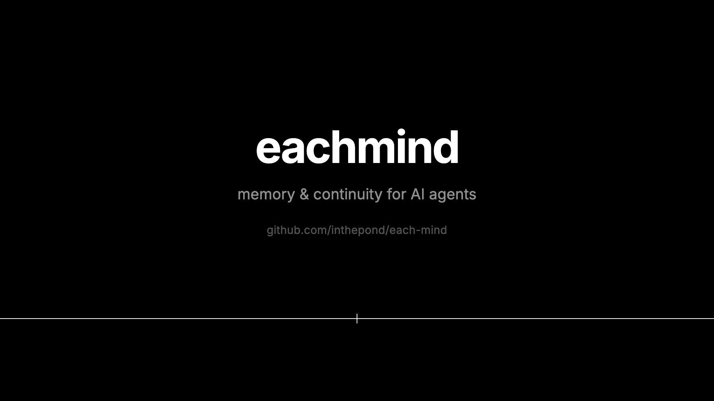
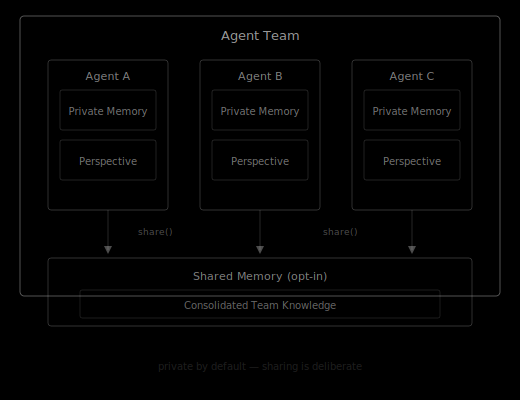
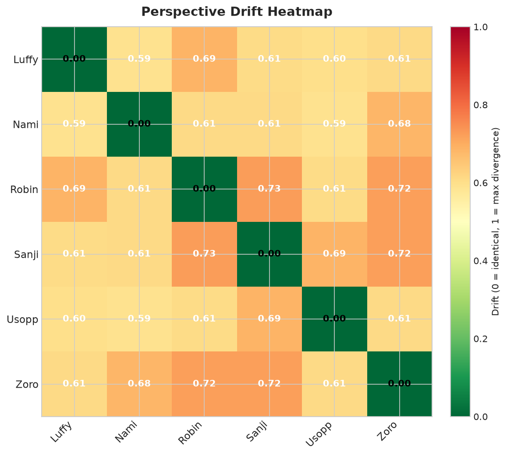
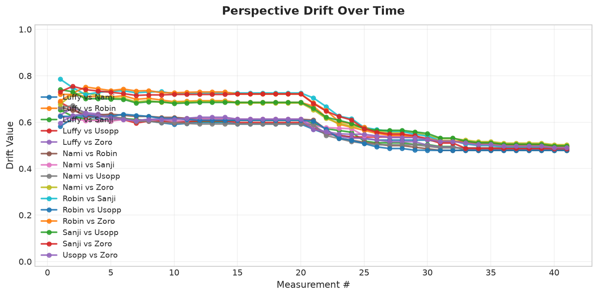

# eachmind

**Per-agent memory protocol for multi-agent systems**

<p align="center">
  <a href="https://github.com/inthepond/each-mind/blob/main/assets/eachmind-intro.mp4">
    
  </a>
  <br>
  <em>▶&nbsp; Click to watch the 22-second intro</em>
</p>

> **The problem:** shared memory = shared perspective = no real team cognition. But fully isolated memory = no collaboration, no learning from each other.

---

## Problem Statement

Current agent swarms share a single memory system. Every agent draws from the same pool of context, producing the same perspective. This creates the illusion of collaboration — agents divide tasks but never truly think differently from each other. Shared memory = shared perspective = no real team cognition.

The opposite — fully isolated agents — breaks collaboration entirely. Agents cannot learn from each other, cannot build on shared experience, and cannot develop institutional knowledge over time.

**eachmind** solves this by giving each agent its own memory — privately encoded, individually shaped — while defining a protocol for what gets selectively shared, when, and how. Agents develop genuine perspectives. Teams develop genuine collective intelligence.

## What It Is

A standalone, framework-agnostic Python library that defines how memory is stored, differentiated, and selectively shared across agents in a multi-agent system. It is a memory protocol — not an agent framework, not a task runner. Any agent system can adopt it.

## Core Primitives

| Primitive | Description |
|---|---|
| **PrivateMemory** | Each agent's own store. Encoded from its perspective. Never automatically shared. |
| **SharedMemory** | What agents explicitly publish to the collective. Opt-in, not default. |
| **MemoryEvent** | A discrete experience. Same event, encoded differently per agent based on its context. |
| **Perspective** | The lens through which an agent encodes events — shaped by its history and role. |
| **Consolidation** | How repeated private experiences abstract into durable beliefs over time. |
| **Drift** | Agents in the same team naturally diverge in perspective over time. Measurable. |

## Design Principles

### Private by default
Memory is private unless explicitly shared. Sharing is a deliberate act, not an automatic sync.

### Same event, different encoding
When agents observe the same event, each encodes it through its own perspective. Divergence is the feature, not the bug.

<picture>
  
</picture>

### Framework agnostic
Works alongside OpenAI Swarm, CrewAI, LangGraph, or a hand-written agent loop. No lock-in.

### Institutional memory emerges
Over time, what agents repeatedly share consolidates into team-level knowledge — without forcing a single shared brain.

## Installation

```bash
pip install eachmind
```

## Quick Start

```python
from eachmind import Agent, MemoryEvent, SharedMemory

# Create agents with their own private memory
analyst = Agent(name="analyst", role="data analysis")
writer = Agent(name="writer", role="content creation")

# Both agents observe the same event
event = MemoryEvent(
    content="Q1 revenue grew 23% YoY",
    source="quarterly_report",
    timestamp="2026-04-10T09:00:00Z"
)

# Each encodes it through their own perspective
analyst.observe(event)  # Encodes: statistical significance, trend implications
writer.observe(event)   # Encodes: narrative angle, audience framing

# Analyst decides to share a finding
analyst.share(
    content="Revenue growth acceleration suggests market expansion",
    to=SharedMemory.TEAM
)

# Writer can now access shared knowledge
shared = writer.recall(source=SharedMemory.TEAM)

# Over time, perspectives naturally drift — and that's measurable
drift = analyst.perspective.drift_from(writer.perspective)
```

## Architecture

<picture>
  
</picture>

## What It Is NOT

- **Not a vector database or RAG system** — eachmind defines memory *behavior*, not storage engines.
- **Not an agent framework or task runner** — it doesn't orchestrate agents or assign tasks.
- **Not a replacement for mem0, Zep, or MemGPT** — those are memory backends; eachmind is a protocol layer above them.
- **Not a multi-agent orchestrator** — it doesn't manage agent coordination or communication routing.

## Project Status

> **Foundation complete.** All core primitives, protocol specification, storage backends, visualizations, and integration examples are implemented. The [team-cognition demo](#team-cognition-demo) wires eachmind into a live multi-agent simulation ([sandbox-anything](https://github.com/inthepond/sandbox-anything)) and shows characters' perspectives measurably diverging and reconverging as they talk — genuine cognitive diversity, made visible.

## Roadmap

- [x] Core primitives implementation
- [x] Protocol specification
- [x] Storage backend adapters (in-memory, SQLite, Redis)
- [x] Integration examples (OpenAI Agents SDK, CrewAI, LangGraph)
- [x] Drift measurement and visualization
- [x] Consolidation algorithms
- [x] Project 2: Team cognition demo — see below

## Team Cognition Demo

The thesis of eachmind — *give each agent its own perspective and the team
develops genuine cognitive diversity* — is best seen, not described. The demo
drives a live [sandbox-anything](https://github.com/inthepond/sandbox-anything)
simulation (a crew of characters talking across channels) and uses eachmind to
measure how far each character's perspective drifts from the others.

The integration is a single adapter,
[`DriftBridge`](https://github.com/inthepond/sandbox-anything/blob/main/src/sandbox_anything/memory/drift_bridge.py),
a `MemoryEncoder` that rides alongside sandbox-anything's own memory layer:
sandbox keeps writing each character's private memories exactly as before, and
the bridge additionally feeds every observation into a per-character eachmind
`Perspective` plus a shared `Drift` tracker. No part of eachmind is replaced —
it adds the one thing the host lacks: a *measure* of divergence.

```bash
pip install -e ./each-mind
pip install -e './sandbox-anything[eachmind]'
python each-mind/examples/sandbox_drift_demo.py
```

The run has two phases. First the crew talks only in small, isolated cliques —
characters who never share a channel develop sharply different perspectives.
Then an "all-hands" channel opens and everyone starts hearing everyone, so the
perspectives partly reconverge. Who-talks-to-whom determines who-thinks-alike:

| Perspectives diverge by channel topology | …then reconverge when the team merges |
|---|---|
|  |  |

See [`examples/sandbox_drift_demo.py`](examples/sandbox_drift_demo.py). It is
free and fully deterministic (a flavoured stub generator stands in for an LLM);
point the bridge at an `LLMMemoryEncoder` for genuinely meaning-bearing drift.

## Contributing

We welcome contributions! Please see [CONTRIBUTING.md](CONTRIBUTING.md) for guidelines.

## License

MIT License — see [LICENSE](LICENSE) for details.
